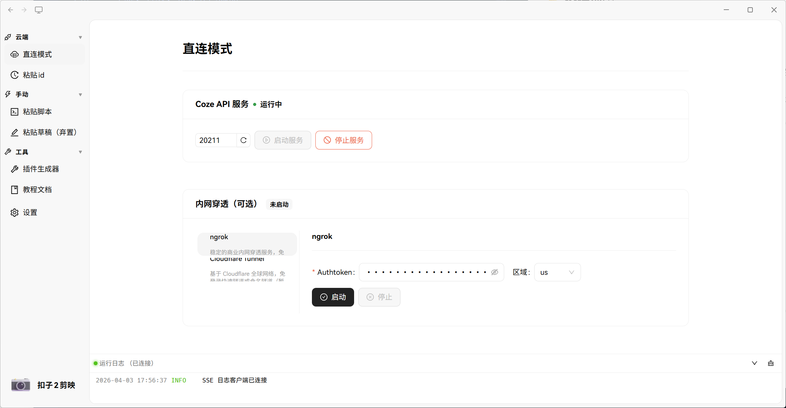

<h1 align="center">开源的剪映小助手：Coze2JianYing</h1>

<div align="center">

[](https://www.gnu.org/licenses/gpl-3.0)

</div>



剪映小助手Coze2JianYing是为 Coze AI 工作流提供剪映制作视频能力的桌面程序。原理是本地运行一个草稿服务，Coze 工作流通过插件将素材参数写入，自动生成可在剪映中直接打开的草稿文件。目前功能趋于完善。

此项目致力于数据隐私的保护，但是...

## Star History

[](https://star-history.com/#Gardene-el/Coze2JianYing\&Date)

## 工作流

本项目支持三种接入模式：

**手工模式**（无需网络穿透，推荐新手）


**粘贴 ID 模式**（类似其他剪映小助手的体验）


> ⚠️ 此模式引入了第三方中转服务 [Coze2JianYing-Capture](https://github.com/Gardene-el/Coze2JianYing-Capture)，草稿数据会经过该服务器，是潜在的数据泄漏点。

**直连模式**（零延迟，需要自行做端口转发）


## 快速上手

**1. 下载并安装应用**

前往 [Releases 页面](https://github.com/Gardene-el/Coze2JianYing/releases) 下载最新版安装包并安装。

**2. 收藏 Coze 插件**

在 Coze 插件商店收藏 [Coze2JianYing 插件](https://www.coze.cn/store/plugin/7565396538596818950?from=plugin_card)，在工作流中调用。

**3. 导入工作流示例**

下载并导入 [`workflow_demo.zip`](https://github.com/Gardene-el/Coze2JianYing/releases) 到 Coze 平台，试运行即可。

## 开发者设置

**环境要求**：Node.js 20+、pnpm 10+、Python 3.11+、uv

```bash
# 安装依赖
pnpm install

# 启动开发模式（含 Python 后端）
pnpm dev

# 构建 Windows 安装包
pnpm build
```

## 资源

* 📦 [Releases](https://github.com/Gardene-el/Coze2JianYing/releases)
* 🔌 [Coze 插件](https://www.coze.cn/store/plugin/7565396538596818950?from=plugin_card)
* 📚 [pyJianYingDraft](https://github.com/GuanYixuan/pyJianYingDraft) — 底层草稿生成库

## 许可证

本项目以 [GPL-3.0](LICENSE) 协议开源。修改后的衍生项目须同样以 GPL-3.0 开源，并保留原作者版权声明。

***

<div align="center">

Made with ❤️ by <a href="https://github.com/Gardene-el">Gardene-el</a>

</div>
