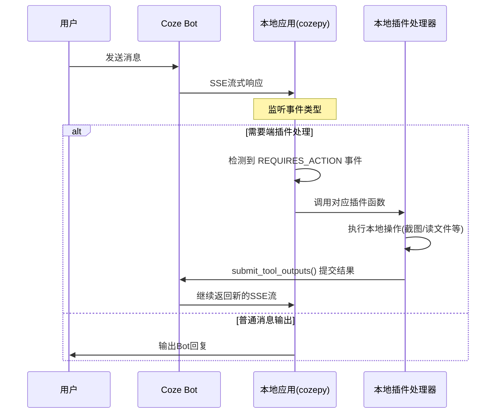

# Coze API Gateway 调查报告

## 📋 调查目标

本报告针对 Issue 中提出的问题进行深入调查：
1. **cozepy 是否提供 API Gateway 功能？**
2. **如何在当前项目中集成 API Gateway？**
3. **最佳的架构方案是什么？**

## 🔍 调查结果

### 1. Coze 本地插件（Local Plugin）机制

#### 1.1 核心概念

根据 [coze-cookbook](https://github.com/coze-dev/coze-cookbook/tree/main/examples/local_plugin) 的官方示例，**Coze 确实支持本地插件（端插件）**，但这并不是传统意义上的 "API Gateway"。

**关键发现：**
- ✅ **Coze 支持"端插件"（Local Plugin）机制**
- ✅ **cozepy SDK 提供了完整的端插件开发支持**
- ⚠️ **这不是 API Gateway，而是一种事件驱动的插件系统**

#### 1.2 工作原理

端插件的工作流程如下：



#### 1.3 技术实现细节

**核心代码结构**（基于官方示例 `agent_chat.py`）：

```python
from cozepy import (
    COZE_CN_BASE_URL,
    ChatEvent,
    ChatEventType,
    Coze,
    Stream,
    TokenAuth,
    ToolOutput,
)

# 1. 定义本地API功能
class LocalAPI:
    @staticmethod
    def screenshot() -> str:
        """本地截屏功能"""
        # 实现本地功能
        pass
    
    @staticmethod
    def list_files(dir: str) -> List[dict]:
        """列出文件"""
        pass

# 2. 封装为Coze插件接口
class LocalPlugin:
    def __init__(self, coze: Coze):
        self.coze = coze
    
    def screenshot(self, tool_call_id: str, arguments: str) -> ToolOutput:
        # 执行本地操作
        result = LocalAPI.screenshot()
        # 返回给Coze
        return ToolOutput(
            tool_call_id=tool_call_id,
            output=json.dumps({"image": result})
        )

# 3. 处理Coze流式事件
def handle_coze_stream(coze: Coze, stream: Stream[ChatEvent]):
    for event in stream:
        # 检测端插件中断事件
        if event.event == ChatEventType.CONVERSATION_CHAT_REQUIRES_ACTION:
            # 调用本地插件处理
            handle_local_plugin(coze, event)

# 4. 启动对话
coze = Coze(auth=TokenAuth(token), base_url=COZE_CN_BASE_URL)
stream = coze.chat.stream(bot_id=bot_id, user_id=user_id, ...)
handle_coze_stream(coze, stream)
```

**关键API：**
- `coze.chat.stream()` - 创建流式对话
- `coze.chat.submit_tool_outputs()` - 提交本地工具执行结果
- `ChatEventType.CONVERSATION_CHAT_REQUIRES_ACTION` - 端插件中断事件

### 2. 与传统 API Gateway 的区别

| 特性 | Coze 端插件 | 传统 API Gateway |
|------|------------|-----------------|
| **架构模式** | 事件驱动、SSE流式 | 请求-响应、RESTful |
| **通信方向** | Coze主动推送事件 | 客户端主动请求 |
| **部署位置** | 客户端（用户本地） | 服务端（云端） |
| **主要用途** | 本地设备交互 | 统一API入口 |
| **网络要求** | 需要长连接 | 短连接即可 |

**重要结论：**
- Coze 的"端插件"不等同于 API Gateway
- 端插件是**客户端侧**的本地功能扩展
- API Gateway 是**服务端侧**的统一API入口

### 3. 当前项目架构分析

#### 3.1 现有架构

当前 Coze2JianYing 项目采用的是**分离式架构**：

```
┌─────────────┐    ┌──────────────────┐    ┌─────────────────┐    ┌─────────────┐
│ Coze 工作流  │───▶│  Coze 插件       │───▶│ 草稿生成器 API   │───▶│    剪映     │
│ (云侧插件)   │    │ (云侧插件/工具)  │    │ (本地/远程)      │    │             │
└─────────────┘    └──────────────────┘    └─────────────────┘    └─────────────┘
```

**已实现的功能：**
1. ✅ Coze 云侧插件 - 在 Coze IDE 中创建的工具函数
2. ✅ 草稿生成器 GUI - 手动粘贴 JSON 生成草稿
3. ✅ 草稿生成器 API - FastAPI 服务（`app/api_main.py`）
4. ✅ 本地服务标签页 - 管理嵌入式 API 服务

#### 3.2 API 服务现状

**当前的 FastAPI 服务：**
- 位置：`app/api_main.py`
- 端口：默认 8000
- 功能：示例 CRUD 接口（`app/api/example_routes.py`）
- 部署：支持独立运行或 GUI 内嵌入式启动

**缺失的功能：**
- ❌ 没有实际的草稿生成 API 端点
- ❌ 没有与 Coze 插件对接的接口
- ❌ 没有认证和安全机制
- ❌ 没有完整的 OpenAPI 规范文档

## 💡 架构改进方案

### 方案一：保持现有架构 + 完善 API（推荐）

**设计思路：**
不引入端插件机制，继续使用"云侧插件 - 基于已有服务创建"的模式，但完善 API 功能。

```
┌─────────────────┐
│  Coze 工作流     │
│  (Bot + 工具)    │
└────────┬────────┘
         │ HTTP POST/GET
         ▼
┌─────────────────────────────┐
│  草稿生成器 FastAPI 服务     │  ◄─── 本方案重点
│  (可本地/可远程部署)         │
├─────────────────────────────┤
│  ✅ /api/draft/generate      │  生成草稿
│  ✅ /api/draft/status        │  查询状态
│  ✅ /api/health             │  健康检查
│  ✅ OAuth 2.0 认证          │  安全机制
│  ✅ 完整 OpenAPI 文档        │  Coze配置用
└─────────────────────────────┘
         │
         ▼
┌─────────────────┐
│    剪映草稿      │
└─────────────────┘
```

**实现步骤：**

1. **添加草稿生成 API 路由**
   - `POST /api/draft/generate` - 接收 Coze 导出的 JSON，生成草稿
   - `GET /api/draft/status/{draft_id}` - 查询草稿生成状态
   - `GET /api/draft/list` - 列出已生成的草稿

2. **添加认证机制**
   - 支持 Bearer Token 或 API Key
   - 可选的 OAuth 2.0 支持

3. **生成 OpenAPI 规范**
   - FastAPI 自动生成（已有 `/docs` 和 `/redoc`）
   - 导出为 `openapi.json` 供 Coze 配置使用

4. **在 Coze 中配置**
   - 创建"云侧插件 - 基于已有服务创建"
   - 上传 OpenAPI 规范
   - 配置认证信息

**优点：**
- ✅ 符合当前项目架构设计
- ✅ 实现简单，改动最小
- ✅ 支持远程部署，不局限于本地
- ✅ 易于维护和扩展
- ✅ 用户可以选择手动粘贴或自动API两种方式

**缺点：**
- ⚠️ 需要用户自行部署 API 服务（本地或云端）
- ⚠️ 需要配置网络访问（防火墙、端口映射等）

### 方案二：引入端插件机制（探索性）

**设计思路：**
使用 cozepy 的端插件机制，让 Coze Bot 直接调用本地应用。

```
┌─────────────────┐
│  Coze Bot        │
│  (配置端插件)    │
└────────┬────────┘
         │ SSE Stream
         │ REQUIRES_ACTION Event
         ▼
┌─────────────────────────────┐
│  本地应用 (Python CLI/GUI)   │  ◄─── 本方案重点
│  基于 cozepy SDK            │
├─────────────────────────────┤
│  • LocalPlugin 类           │
│  • 监听 Coze 事件流         │
│  • 处理端插件调用           │
│  • 生成草稿并返回结果       │
└─────────────────────────────┘
         │
         ▼
┌─────────────────┐
│    剪映草稿      │
└─────────────────┘
```

**实现步骤：**

1. **创建端插件处理模块**
   ```python
   # app/plugins/local_plugin.py
   class CozeLocalPlugin:
       def __init__(self, coze: Coze):
           self.coze = coze
           self.draft_generator = DraftGenerator()
       
       def generate_draft(self, tool_call_id: str, arguments: str) -> ToolOutput:
           args = json.loads(arguments)
           result = self.draft_generator.generate(
               args['content'],
               args.get('output_folder')
           )
           return ToolOutput(
               tool_call_id=tool_call_id,
               output=json.dumps({"draft_ids": result})
           )
   ```

2. **创建事件监听器**
   ```python
   # app/coze_agent.py
   def start_coze_agent(token: str, bot_id: str):
       coze = Coze(auth=TokenAuth(token), base_url=COZE_CN_BASE_URL)
       plugin = CozeLocalPlugin(coze)
       
       while True:
           user_input = input("请输入: ")
           stream = coze.chat.stream(
               bot_id=bot_id,
               user_id=user_id,
               additional_messages=[Message.build_user_question_text(user_input)]
           )
           handle_stream_with_local_plugin(coze, stream, plugin)
   ```

3. **在 Coze 中配置端插件**
   - 创建端插件配置 JSON
   - 上传到 Coze 平台
   - 在 Bot 中关联端插件

**优点：**
- ✅ 无需部署独立 API 服务
- ✅ 更紧密的 Coze 集成
- ✅ 支持更多本地操作（文件访问、截图等）

**缺点：**
- ❌ 用户必须运行本地应用
- ❌ 需要保持与 Coze 的长连接
- ❌ 不支持远程部署
- ❌ 与当前架构不匹配（需要大幅重构）
- ❌ 复杂度增加，维护成本高

### 方案三：混合架构（最完整但复杂）

同时支持两种模式，让用户自由选择：
- **模式1：手动粘贴** - GUI 手动操作
- **模式2：API服务** - FastAPI 自动化
- **模式3：端插件** - cozepy 本地集成

**优点：**
- ✅ 最大灵活性
- ✅ 覆盖所有使用场景

**缺点：**
- ❌ 开发和维护成本最高
- ❌ 用户学习成本增加
- ❌ 可能造成功能冗余

## 🎯 推荐方案

### **推荐：方案一（保持现有架构 + 完善 API）**

**理由：**

1. **符合项目设计理念**
   - 分离式架构设计从一开始就是为了解决 Coze 平台的空间限制
   - 草稿生成器作为独立服务更符合微服务设计原则

2. **实现成本低**
   - 只需添加草稿生成相关的 API 端点
   - 不需要重构现有代码
   - FastAPI 框架已经就位

3. **用户友好**
   - 支持本地部署（GUI 内嵌入式 API）
   - 支持远程部署（独立 API 服务）
   - 保留手动粘贴模式（向后兼容）

4. **易于扩展**
   - 可以轻松添加新的 API 功能
   - 支持第三方集成
   - 便于自动化和批处理

5. **文档和生态**
   - OpenAPI/Swagger 文档自动生成
   - 标准 RESTful API，易于理解
   - 与 Coze "基于已有服务创建插件"的模式完美契合

## 📝 实施计划

### 第一阶段：完善 API 核心功能

1. **创建草稿生成 API 模块**
   - `app/api/draft_routes.py` - 草稿相关端点
   - 实现 `POST /api/draft/generate` 接口
   - 实现 `GET /api/draft/status/{draft_id}` 接口
   - 实现 `GET /api/draft/list` 接口

2. **添加请求/响应模型**
   - `app/schemas/draft_schemas.py` - Pydantic 数据模型
   - 定义 `DraftGenerateRequest`
   - 定义 `DraftGenerateResponse`
   - 定义 `DraftStatusResponse`

3. **集成现有草稿生成器**
   - 在 API 路由中调用 `DraftGenerator`
   - 处理异步任务（可选）
   - 错误处理和日志记录

### 第二阶段：认证和安全

1. **添加简单的 Token 认证**
   - Bearer Token 或 API Key
   - 在 GUI 本地服务标签页生成和管理 Token

2. **添加 CORS 配置**
   - 已有基础配置，可能需要调整

3. **添加速率限制**（可选）
   - 防止滥用

### 第三阶段：Coze 集成

1. **导出 OpenAPI 规范**
   - FastAPI 已自动生成
   - 添加导出功能到 GUI

2. **在 Coze 中创建服务端插件**
   - 上传 OpenAPI 规范
   - 配置认证
   - 测试端到端流程

3. **文档和示例**
   - 编写集成指南
   - 提供 Coze 工作流示例
   - 更新 README

### 第四阶段：优化和增强（可选）

1. **异步任务支持**
   - 使用 Celery 或 FastAPI BackgroundTasks
   - 支持大型草稿的后台生成

2. **WebSocket 支持**
   - 实时进度推送
   - 更好的用户体验

3. **探索端插件机制**（研究性质）
   - 创建独立的实验分支
   - 验证端插件的可行性
   - 作为未来可能的功能选项

## 📚 参考资源

1. **Coze 官方文档**
   - [Coze 开发者文档](https://www.coze.cn/open/docs/developer_guides)
   - [端插件教程](https://bytedance.larkoffice.com/docx/AAAedsXYAolDEVx47yJcsth2nrd)

2. **Coze Python SDK**
   - [coze-py GitHub](https://github.com/coze-dev/coze-py)
   - [coze-cookbook](https://github.com/coze-dev/coze-cookbook)

3. **本项目相关文档**
   - `.github/copilot-instructions.md` - 项目开发规范
   - `docs/guides/DEVELOPMENT_ROADMAP.md` - 功能开发历程
   - `docs/draft_generator/ARCHITECTURE_AND_WORKFLOW.md` - 架构文档

## ✅ 结论

**Coze 的"端插件"不等于 API Gateway，但 cozepy SDK 确实提供了完整的本地插件开发支持。**

对于 Coze2JianYing 项目：
- ✅ **不需要引入端插件机制**
- ✅ **继续使用分离式架构**
- ✅ **完善现有的 FastAPI 服务**
- ✅ **通过"基于已有服务创建插件"与 Coze 集成**

这是最符合项目设计理念、实现成本最低、用户体验最好的方案。

---

*调查完成时间：2025-11-04*  
*文档版本：v1.0*
