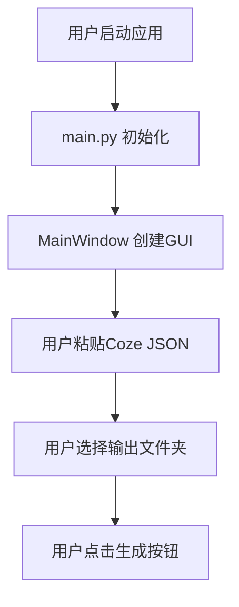
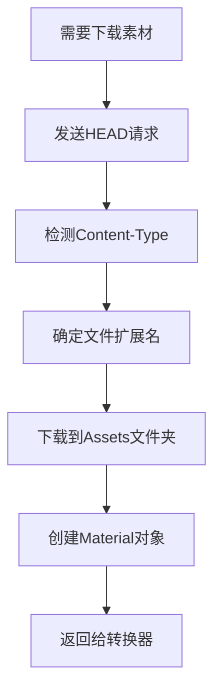
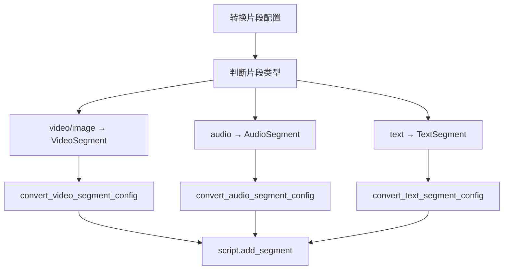

# Coze 剪映草稿生成器 - 完整架构与工作流

## 🏗️ 系统架构图

```
┌─────────────────────────────────────────────────────────────────┐
│                          用户界面层 (GUI)                        │
├─────────────────────────────────────────────────────────────────┤
│  📱 MainWindow (main_window.py)                                │
│  ├── 粘贴内容输入框                                             │
│  ├── 输出文件夹选择                                             │
│  ├── 生成按钮触发                                               │
│  └── 📊 LogWindow (log_window.py) - 实时日志显示                │
└─────────────────────────────────────────────────────────────────┘
                                    ↓
┌─────────────────────────────────────────────────────────────────┐
│                          应用入口层                              │
├─────────────────────────────────────────────────────────────────┤
│  🚀 main.py - 应用启动入口                                       │
│  ├── 设置日志系统                                               │
│  ├── 创建主窗口                                                 │
│  └── 启动事件循环                                               │
└─────────────────────────────────────────────────────────────────┘
                                    ↓
┌─────────────────────────────────────────────────────────────────┐
│                        核心业务层 (Core)                        │
├─────────────────────────────────────────────────────────────────┤
│  🎯 DraftGenerator (draft_generator.py) - 核心转换引擎           │
│  ├── generate(content, output_folder) → List[str]              │
│  ├── generate_from_file(file_path, output_folder) → List[str]   │
│  ├── _convert_drafts() - 处理多个草稿                           │
│  └── _convert_single_draft() - 处理单个草稿                     │
└─────────────────────────────────────────────────────────────────┘
                    ↓              ↓              ↓
┌─────────────────┬─────────────────┬─────────────────────────────┐
│   🔍 解析模块    │   🔄 转换模块    │        📦 素材模块          │
├─────────────────┼─────────────────┼─────────────────────────────┤
│ CozeOutputParser│ Converter       │    MaterialManager          │
│ (coze_parser.py)│ (converter.py)  │ (material_manager.py)       │
│                 │                 │                             │
│ • parse()       │ • convert_video │ • create_material()         │
│ • parse_from_   │ _segment_config │ • download_material()       │
│   _clipboard()  │ • convert_audio │ • Content-Type检测           │
│ • parse_from_   │ _segment_config │ • _get_extension_from_      │
│   _file()       │ • convert_text  │   _content_type()           │
│ • print_summary │ _segment_config │ • 素材缓存管理               │
│   ()            │ • convert_time  │ • list_downloaded_          │
│                 │   range()       │   materials()              │
│                 │ • convert_clip  │                             │
│                 │   _settings()   │                             │
└─────────────────┴─────────────────┴─────────────────────────────┘
                                    ↓
┌─────────────────────────────────────────────────────────────────┐
│                    第三方库层 (External)                         │
├─────────────────────────────────────────────────────────────────┤
│  🎬 pyJianYingDraft - 剪映草稿操作库                            │
│  ├── DraftFolder - 草稿文件夹管理                               │
│  ├── ScriptFile - 草稿脚本文件操作                              │
│  ├── TrackType - 轨道类型枚举                                   │
│  ├── VideoSegment, AudioSegment, TextSegment - 片段类型         │
│  ├── VideoMaterial, AudioMaterial - 素材类型                   │
│  └── Timerange, ClipSettings, TextStyle - 配置类型             │
└─────────────────────────────────────────────────────────────────┘
                                    ↓
┌─────────────────────────────────────────────────────────────────┐
│                         输出层 (Output)                         │
├─────────────────────────────────────────────────────────────────┤
│  📁 剪映草稿文件结构                                            │
│  {output_folder}/                                              │
│  └── {draft_id}/                                               │
│      ├── draft_content.json - 草稿主要内容                      │
│      ├── draft_meta_info.json - 草稿元数据                     │
│      └── Assets/ - 素材文件夹                                   │
│          ├── material_*.png - 图片素材                          │
│          ├── speech_*.mp3 - 音频素材                            │
│          └── material_*.mp4 - 视频素材                          │
└─────────────────────────────────────────────────────────────────┘
```

## 🚀 完整工作流程

### 阶段 1: 用户交互 (GUI 层)



**涉及文件:**

- `src/main.py` - 应用启动入口
- `src/gui/main_window.py` - 主窗口界面
- `src/gui/log_window.py` - 日志窗口

### 阶段 2: 核心处理 (业务层)

```mermaid
graph TD
    F[点击生成] --> G[DraftGenerator.generate()]
    G --> H[CozeOutputParser.parse()]
    H --> I[解析JSON结构]
    I --> J[提取草稿数据]
    J --> K[_convert_drafts()]
    K --> L[遍历每个草稿]
    L --> M[_convert_single_draft()]
```

**涉及文件:**

- `src/utils/draft_generator.py` - 🎯 **核心引擎**
- `src/utils/coze_parser.py` - JSON 解析
- `src/utils/logger.py` - 日志系统

### 阶段 3: 草稿转换 (转换层)

```mermaid
graph TD
    M[_convert_single_draft] --> N[创建DraftFolder]
    N --> O[创建ScriptFile]
    O --> P[添加轨道]
    P --> Q[处理每个轨道]
    Q --> R[处理每个片段]
    R --> S[下载素材]
    S --> T[转换片段配置]
    T --> U[添加片段到轨道]
    U --> V[script.save()]
    V --> W[返回草稿路径]
```

**涉及文件:**

- `src/utils/draft_generator.py` - 转换协调
- `src/utils/converter.py` - 数据结构转换
- `src/utils/material_manager.py` - 素材下载管理

### 阶段 4: 素材处理 (素材层)



**涉及文件:**

- `src/utils/material_manager.py` - 素材下载和管理
- `pyJianYingDraft` - 素材对象创建

### 阶段 5: 片段转换 (转换层详细)



**涉及文件:**

- `src/utils/converter.py` - 具体转换逻辑
- `pyJianYingDraft` - 目标数据结构

## 📁 关键文件分析

### 🎯 核心文件 (必需)

#### 1. `src/utils/draft_generator.py` - **主引擎**

```python
class DraftGenerator:
    """剪映草稿生成器 - 从Coze输出到剪映草稿的完整转换"""

    def generate(self, content: str, output_folder: str) -> List[str]:
        """从JSON字符串生成草稿"""
        # 1. 解析JSON
        parsed_data = self.parser.parse(content)
        # 2. 转换所有草稿
        return self._convert_drafts(parsed_data)

    def _convert_single_draft(self, draft_data: Dict) -> str:
        """转换单个草稿的完整流程"""
        # 创建ScriptFile → 添加轨道 → 处理片段 → 保存
        pass
```

**职责:**

- 📋 协调整个转换流程
- 🎯 管理多个草稿的转换
- 🔗 连接解析器、转换器、素材管理器
- 💾 调用 pyJianYingDraft 生成草稿文件

#### 2. `src/utils/coze_parser.py` - **JSON 解析器**

```python
class CozeOutputParser:
    """解析Coze输出的JSON数据"""

    def parse(self, content: str) -> Dict:
        """解析JSON字符串"""
        # 处理双重嵌套JSON
        # 提取草稿、轨道、片段信息
        pass

    def print_summary(self):
        """打印解析摘要"""
        pass
```

**职责:**

- 🔍 解析 Coze 的复杂 JSON 结构
- 📊 提取草稿元数据(ID、名称、分辨率等)
- 🎬 提取轨道和片段数据
- 📋 生成解析摘要报告

#### 3. `src/utils/converter.py` - **数据转换器**

```python
class DraftInterfaceConverter:
    """Draft Generator Interface 到 pyJianYingDraft 的转换器"""

    def convert_video_segment_config(self, segment_config, video_material) -> VideoSegment:
        """转换视频片段配置"""
        pass

    def convert_audio_segment_config(self, segment_config, audio_material) -> AudioSegment:
        """转换音频片段配置"""
        pass

    def convert_text_segment_config(self, segment_config) -> TextSegment:
        """转换文本片段配置"""
        pass
```

**职责:**

- 🔄 转换时间范围格式
- 🎨 转换变换设置(位置、缩放、旋转等)
- 📝 转换文本样式
- 🎬 创建具体的 Segment 对象

#### 4. `src/utils/material_manager.py` - **素材管理器**

```python
class MaterialManager:
    """素材下载和管理器"""

    def create_material(self, url: str) -> Union[VideoMaterial, AudioMaterial]:
        """从URL下载素材并创建Material对象"""
        # 1. 检测Content-Type
        # 2. 下载到Assets文件夹
        # 3. 创建对应Material对象
        pass

    def _get_extension_from_content_type(self, content_type: str) -> str:
        """根据Content-Type获取正确扩展名"""
        pass
```

**职责:**

- 🌐 从 URL 下载素材文件
- 🔍 通过 Content-Type 检测文件类型
- 📁 管理 Assets 文件夹
- 🎬 创建 VideoMaterial/AudioMaterial 对象
- 💾 素材缓存管理

### 🖥️ 界面文件 (必需)

#### 5. `src/gui/main_window.py` - **主界面**

```python
class MainWindow:
    """主窗口类"""

    def __init__(self):
        self.draft_generator = DraftGenerator()  # 核心引擎

    def _on_generate(self):
        """生成按钮点击事件"""
        content = self.input_text.get("1.0", tk.END)
        draft_paths = self.draft_generator.generate(content, self.output_folder)
```

**职责:**

- 🎨 创建用户界面
- 📝 接收用户输入的 JSON 内容
- 📁 文件夹选择和自动检测
- 🚀 调用核心引擎生成草稿
- 📊 显示结果和日志

#### 6. `src/main.py` - **应用入口**

```python
def main():
    """主函数"""
    setup_logger()
    app = MainWindow()
    app.run()
```

**职责:**

- 🚀 应用程序启动入口
- 📋 设置日志系统
- 🎯 创建和运行主窗口

### 🛠️ 支撑文件 (必需)

#### 7. `src/utils/logger.py` - **日志系统**

```python
def setup_logger(log_file):
    """设置日志系统"""
    pass

def get_logger(name):
    """获取日志器"""
    pass
```

**职责:**

- 📋 统一日志格式和输出
- 🎯 支持文件和 GUI 双重输出
- 🔍 调试信息记录

### ❌ 废弃文件 (可删除)

#### `src/utils/coze_to_draft.py` - **已废弃!**

**分析:**

```python
class CozeToDraftConverter:
    """从Coze输出到剪映草稿的完整转换器"""

    def convert_from_clipboard(self, clipboard_text: str) -> List[str]:
        """从剪贴板文本转换生成草稿"""
        # 这个功能已经被 DraftGenerator.generate() 替代
```

**废弃原因:**

1. **功能重复** - `DraftGenerator` 已完全实现相同功能
2. **架构过时** - 使用旧的 API 设计模式
3. **无人调用** - grep 搜索显示没有任何地方 import 这个类
4. **维护负担** - 保留会增加维护复杂性

**验证是否可删除:**

```bash
# 搜索结果: No matches found
grep -r "CozeToDraftConverter" **/*.py
grep -r "from.*coze_to_draft" **/*.py
grep -r "import.*coze_to_draft" **/*.py
```

✅ **可以安全删除!**

## 📊 依赖关系图

```
main.py
    └── gui/main_window.py
            └── utils/draft_generator.py  ← 🎯 核心
                    ├── utils/coze_parser.py
                    ├── utils/converter.py
                    ├── utils/material_manager.py
                    └── utils/logger.py
                            └── gui/log_window.py

utils/coze_to_draft.py  ← ❌ 废弃文件 (无依赖关系)
```

## 🔄 数据流向图

```
JSON字符串 (用户粘贴)
    ↓
CozeOutputParser.parse()
    ↓
解析后的数据结构 {drafts: [...]}
    ↓
DraftGenerator._convert_drafts()
    ↓
for each draft in drafts:
    ├── 创建DraftFolder/ScriptFile (pyJianYingDraft)
    ├── 添加轨道 (video_track, audio_track, text_track)
    └── for each segment:
            ├── MaterialManager.create_material(url)
            ├── Converter.convert_*_segment_config()
            ├── script.add_segment(segment, track_name)
            └── script.save()  ← 生成最终文件
    ↓
List[草稿路径] (返回给用户)
```

## 🎯 核心设计模式

### 1. **责任链模式 (Chain of Responsibility)**

```
用户输入 → Parser → Generator → Converter → MaterialManager → pyJianYingDraft
```

### 2. **建造者模式 (Builder Pattern)**

```python
# 构建草稿的步骤
script = draft_folder.create_draft()  # 创建建造者
script.add_track()                    # 添加组件
script.add_segment()                  # 添加组件
script.save()                         # 完成构建
```

### 3. **工厂模式 (Factory Pattern)**

```python
# MaterialManager 根据URL类型创建不同Material
def create_material(url) -> Union[VideoMaterial, AudioMaterial]:
    if file_type == 'video':
        return VideoMaterial(path)
    elif file_type == 'audio':
        return AudioMaterial(path)
```

### 4. **门面模式 (Facade Pattern)**

```python
# DraftGenerator 为复杂转换流程提供简单接口
class DraftGenerator:
    def generate(self, content: str, output_folder: str) -> List[str]:
        # 隐藏复杂的内部协调逻辑
        pass
```

## 📝 关键 API 接口

### 外部接口 (用户调用)

```python
# 主要API
generator = DraftGenerator(output_base_dir)
draft_paths = generator.generate(json_content, output_folder)

# 备用API
draft_paths = generator.generate_from_file(json_file_path, output_folder)
```

### 内部接口 (组件间)

```python
# 解析器接口
parsed_data = parser.parse(content)
parser.print_summary()

# 转换器接口
video_segment = converter.convert_video_segment_config(segment_config, material)
audio_segment = converter.convert_audio_segment_config(segment_config, material)
text_segment = converter.convert_text_segment_config(segment_config)

# 素材管理器接口
material = material_manager.create_material(url)
materials = material_manager.list_downloaded_materials()
```

### pyJianYingDraft 接口 (第三方库)

```python
# 草稿操作接口
draft_folder = draft.DraftFolder(path)
script = draft_folder.create_draft(name, width, height, fps)
script.add_track(track_type, track_name)
script.add_segment(segment, track_name)
script.save()

# 素材对象接口
video_material = draft.VideoMaterial(file_path)
audio_material = draft.AudioMaterial(file_path)
```

## 🧪 测试文件说明

### 测试架构

```
test_coze_conversion.py     ← 🎯 集成测试 (推荐)
test_converter.py           ← 转换器单元测试
test_material_manager.py    ← 素材管理器单元测试
test_app.py                 ← GUI测试
tests/test_draft_generator.py  ← 核心引擎测试
```

### 推荐测试策略

```bash
# 完整功能测试
python test_coze_conversion.py

# 组件单独测试
python test_converter.py
python test_material_manager.py

# GUI测试
python test_app.py
```

## 📦 打包和部署

### PyInstaller 配置

```python
# CozeJianYingDraftGenerator.spec
a = Analysis(
    ['src/main.py'],
    pathex=[],
    binaries=[],
    datas=[
        ('src/gui', 'gui'),
        ('src/utils', 'utils'),
        ('pyJianYingDraft/assets', 'pyJianYingDraft/assets'),  # 关键!
    ],
    # ...
)
```

### 构建命令

```bash
# 开发构建
python build.py

# 手动构建
pyinstaller CozeJianYingDraftGenerator.spec
```

## 🎯 总结

### ✅ 核心文件 (8 个) - **必须保留**

1. `src/main.py` - 应用入口
2. `src/gui/main_window.py` - 主界面
3. `src/gui/log_window.py` - 日志窗口
4. `src/utils/draft_generator.py` - **🎯 核心引擎**
5. `src/utils/coze_parser.py` - JSON 解析
6. `src/utils/converter.py` - 数据转换
7. `src/utils/material_manager.py` - 素材管理
8. `src/utils/logger.py` - 日志系统

### ❌ 废弃文件 (1 个) - **可以删除**

1. `src/utils/coze_to_draft.py` - **已被 DraftGenerator 完全替代**

### 🏗️ 架构特点

- **分层清晰** - GUI 层 → 业务层 → 转换层 → 第三方库层
- **职责单一** - 每个模块专注特定功能
- **松耦合** - 组件间通过接口交互
- **易扩展** - 新增功能只需修改对应层级
- **易测试** - 每个组件都可独立测试

### 🎯 核心优势

1. **用户体验好** - GUI 界面直观易用
2. **转换准确** - 完整支持视频/音频/文本轨道
3. **素材智能** - 自动检测文件类型和 Content-Type
4. **错误友好** - 完善的日志和异常处理
5. **可维护性** - 清晰的代码结构和文档

**结论:** `coze_to_draft.py` 可以安全删除,不会影响任何功能!
