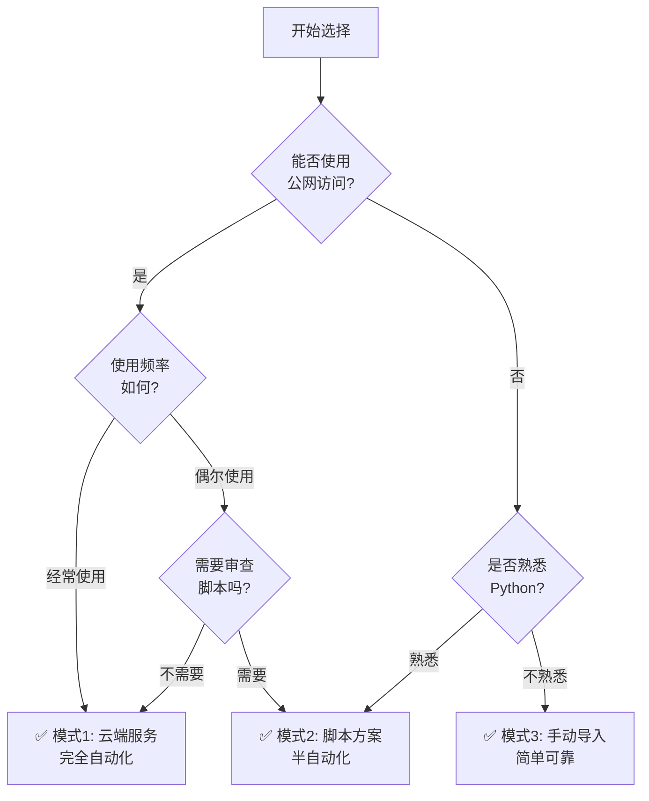

# Coze2JianYing 使用模式选择指南

## 📖 概述

本指南帮助你选择最适合自己的 Coze2JianYing 使用模式。项目提供**三种主要模式**，每种模式有不同的自动化程度、使用复杂度和适用场景。

## 🎯 快速决策流程图



## 📊 三种模式对比

| 特性 | 模式1: 云端服务 | 模式2: 脚本方案 | 模式3: 手动导入 |
|------|---------------|----------------|----------------|
| **自动化程度** | ✅✅✅ 完全自动 | ⚠️⚠️ 半自动 | ❌ 完全手动 |
| **使用复杂度** | 中等 | 中等 | 简单 |
| **配置难度** | 中等 | 低 | 无 |
| **维护成本** | 低 | 中等 | 高 |
| **网络需求** | 需要公网 | 无 | 无 |
| **数据安全** | 中等 | 高 | 最高 |
| **适合新手** | ⚠️ | ⚠️ | ✅ |
| **适合频繁使用** | ✅ | ⚠️ | ❌ |

## 🚀 模式 1: 云端服务（推荐）

### 特点
- **完全自动化**: 工作流生成 → API 调用 → 自动生成草稿
- **维护成本低**: 使用标准 HTTP API，无需维护自定义格式
- **实时反馈**: 即时错误提示和状态反馈

### 工作流程
```
Coze 工作流 → HTTP API 调用 → FastAPI 服务 → 自动下载素材 → 生成剪映草稿
```

### 适用场景
✅ 经常使用 Coze2JianYing  
✅ 有公网访问条件（本地 + ngrok，或云服务器）  
✅ 需要完全自动化的工作流  
✅ 希望减少维护工作  

### 快速开始

#### 步骤 1: 启动 API 服务

1. 打开草稿生成器应用
2. 切换到 **"云端服务"** 标签页
3. 点击 **"启动服务"** 按钮
4. 等待服务启动成功（显示绿色状态）

#### 步骤 2: 配置公网访问（如需远程访问）

**方案 A: 使用 ngrok（推荐）**

1. 在 [ngrok.com](https://ngrok.com) 注册账号
2. 获取 authtoken
3. 在 "云端服务" 标签页输入 authtoken
4. 点击 **"启动 ngrok"** 按钮
5. 复制生成的公网地址（如 `https://xxx.ngrok.io`）

**方案 B: 使用云服务器**

1. 将项目部署到云服务器
2. 启动 API 服务: `python start_api.py`
3. 配置防火墙开放 8000 端口
4. 使用服务器公网 IP + 端口访问

#### 步骤 3: 在 Coze 中配置插件

1. 在 Coze 平台创建 **"云侧插件 - 基于已有服务"**
2. 配置 API 端点:
   - 本地: `http://127.0.0.1:8000`
   - ngrok: `https://your-id.ngrok.io`
   - 云服务器: `http://your-server-ip:8000`
3. 使用 OpenAPI 规范定义接口（项目提供生成工具）
4. 测试插件连接

#### 步骤 4: 在工作流中使用

1. 在工作流中添加插件节点
2. 调用 `/api/draft/create` 创建草稿
3. 调用 `/api/draft/{id}/add-*` 添加内容
4. 调用 `/api/draft/{id}/save` 保存草稿
5. 工作流自动完成，草稿自动生成

### 优势
- ✅ 零手动操作，完全自动化
- ✅ 标准 HTTP API，易于维护和扩展
- ✅ 实时状态反馈和错误处理
- ✅ 支持流式处理，边生成边传输

### 注意事项
- ⚠️ 需要保持 API 服务运行
- ⚠️ 使用 ngrok 需要稳定网络连接
- ⚠️ 公网访问需要注意安全性（建议配置认证）

### 相关文档
- `API_QUICKSTART.md` - API 快速开始
- `docs/API_DESIGN.md` - API 设计文档
- `docs/NGROK_INTEGRATION_README.md` - ngrok 配置指南

---

## 📝 模式 2: 脚本方案（中间方案）

### 特点
- **半自动化**: 生成脚本 → 复制执行 → 自动调用 API
- **可审查**: 用户可以查看和修改脚本内容
- **可复用**: 脚本可以保存并重复使用

### 工作流程
```
Coze 工作流 → generate_script 工具 → 生成 Python 脚本 → 用户复制并执行 → 调用 API → 生成草稿
```

### 适用场景
✅ 无法使用公网访问  
✅ 需要审查自动化流程  
✅ 希望保存和重复使用脚本  
✅ 熟悉 Python 基础操作  
✅ 对完全手动方式不满意  

### 快速开始

#### 步骤 1: 在 Coze 中配置脚本生成

1. 在 Coze IDE 中创建 `generate_script` 工具函数
   - 复制 `coze_plugin/tools/generate_script/handler.py` 内容
   - 配置输入输出参数（参考 README）

2. 在工作流中使用:
   ```
   [create_draft] → [add_images/audios/captions] → [generate_script] → [输出节点]
   ```

3. 工作流返回完整的 Python 脚本

#### 步骤 2: 执行脚本

**方式 A: 保存为文件后执行**

1. 复制 Coze 输出的脚本
2. 保存为 `.py` 文件（如 `generate_my_draft.py`）
3. 确保 API 服务正在运行
4. 执行脚本:
   ```bash
   python generate_my_draft.py
   ```

**方式 B: 在应用中执行（未来功能）**

1. 复制脚本到草稿生成器的"脚本执行"标签页
2. 审查脚本内容
3. 点击"执行脚本"按钮
4. 查看执行结果

#### 步骤 3: 查看结果

脚本会自动:
1. 检查 API 服务连接
2. 创建草稿
3. 添加所有内容
4. 保存草稿到剪映
5. 显示完成信息

### 脚本依赖

**必需**:
- Python 3.7+
- requests 库: `pip install requests`

**可选**:
- 所有项目依赖（如果需要高级功能）

### 优势
- ✅ 比手动 JSON 粘贴更自动化
- ✅ 可以审查和自定义脚本
- ✅ 脚本可以保存和重复使用
- ✅ 无需公网访问

### 注意事项
- ⚠️ 仍需手动复制和执行脚本
- ⚠️ 需要基本的 Python 操作知识
- ⚠️ 执行脚本前需审查内容确保安全
- ⚠️ 需要本地 API 服务运行

### 脚本示例

生成的脚本结构:
```python
#!/usr/bin/env python3
"""Coze2JianYing 自动草稿生成脚本"""

import requests

# 配置（由 Coze 自动填充）
API_BASE_URL = "http://127.0.0.1:8000"
DRAFT_CONFIG = {...}
DRAFT_CONTENT = {...}

# 自动生成的函数
def create_draft(): ...
def add_content(): ...
def save_draft(): ...

# 主流程
def main():
    # 检查服务
    # 创建草稿
    # 添加内容
    # 保存草稿
    pass

if __name__ == "__main__":
    main()
```

### 相关文档
- `coze_plugin/tools/generate_script/README.md` - 工具文档
- `scripts/draft_generation_script_template.py` - 脚本模板

---

## ✋ 模式 3: 手动导入（基础方案）

### 特点
- **完全手动**: 复制 JSON → 粘贴到 GUI → 生成草稿
- **最简单**: 无需配置，开箱即用
- **最安全**: 数据完全本地，不经过网络

### 工作流程
```
Coze 插件 → export_drafts → 生成 JSON → 用户手动复制 → 粘贴到 GUI → 生成草稿
```

### 适用场景
✅ 偶尔使用 Coze2JianYing  
✅ 对数据安全有严格要求  
✅ 网络不稳定或无网络环境  
✅ 不熟悉编程和脚本  
✅ 希望操作简单直接  

### 快速开始

#### 步骤 1: 在 Coze 中导出 JSON

1. 在工作流中使用 `export_drafts` 工具
2. 配置参数:
   - `draft_ids`: 要导出的草稿 ID（或留空）
   - `export_all`: 选择 true 导出所有草稿
3. 运行工作流
4. 复制输出的 JSON 数据

#### 步骤 2: 在应用中生成草稿

1. 打开草稿生成器应用
2. 切换到 **"手动草稿生成"** 标签页
3. 在输入框中粘贴 JSON 数据
4. 选择输出文件夹（或使用自动检测）
5. 点击 **"生成草稿"** 按钮
6. 等待生成完成

#### 步骤 3: 在剪映中打开

1. 打开剪映专业版
2. 在草稿列表中找到新生成的项目
3. 开始编辑

### 优势
- ✅ 操作简单，无需配置
- ✅ 完全离线，数据安全
- ✅ 无需编程知识
- ✅ 出错易于定位

### 注意事项
- ⚠️ 每次都需要手动复制粘贴
- ⚠️ 需要维护自定义 JSON 格式
- ⚠️ 大量使用时效率较低

### JSON 格式示例

```json
{
  "draft_name": "我的项目",
  "width": 1920,
  "height": 1080,
  "fps": 30,
  "tracks": [
    {
      "track_type": "video",
      "segments": [
        {
          "segment_type": "image",
          "material_url": "https://example.com/image.jpg",
          "time_range": {"start": 0, "duration": 3000000}
        }
      ]
    }
  ]
}
```

### 改进建议

**未来可能的改进**:
- 文件拖放支持
- 剪贴板自动监听
- JSON 格式验证和提示
- 批量导入支持

---

## 🤔 如何选择？

### 场景 1: 我是视频创作者，经常使用

**推荐**: 模式 1 - 云端服务

**原因**:
- 完全自动化，节省大量时间
- 一次配置，长期使用
- 实时反馈，出错易于发现

**配置方法**: 使用 ngrok 或云服务器

---

### 场景 2: 我偶尔使用，不想配置复杂的服务

**推荐**: 模式 3 - 手动导入

**原因**:
- 最简单，无需配置
- 使用频率低，手动操作可接受
- 完全离线，安全可靠

**如果觉得手动太麻烦**: 可以尝试模式 2 - 脚本方案

---

### 场景 3: 我对自动化有需求，但无法使用公网

**推荐**: 模式 2 - 脚本方案

**原因**:
- 半自动化，比手动方便
- 无需公网访问
- 脚本可以保存重复使用

**前提**: 需要基本的 Python 操作知识

---

### 场景 4: 我需要审查每一步操作

**推荐**: 模式 2 - 脚本方案 或 模式 3 - 手动导入

**原因**:
- 脚本方案: 可以查看和修改脚本
- 手动导入: 完全可控，可以审查 JSON

**不推荐**: 模式 1（自动化程度高，难以审查）

---

### 场景 5: 我在企业内网环境，无法访问外网

**推荐**: 模式 3 - 手动导入

**原因**:
- 完全离线工作
- 不依赖任何网络服务
- 数据不出内网

**如果有内网 API 服务**: 可以使用模式 1 或模式 2

---

## 📚 进阶使用

### 混合使用多种模式

**场景**: 不同情况使用不同模式

**示例**:
- 日常使用: 模式 1（云端服务）
- 敏感项目: 模式 3（手动导入）
- 测试调试: 模式 2（脚本方案）

---

### 从手动过渡到自动化

**步骤**:
1. 开始使用模式 3（手动导入），熟悉流程
2. 学习基本的 Python，尝试模式 2（脚本方案）
3. 配置 ngrok 或云服务器，升级到模式 1（云端服务）

---

## 🆘 常见问题

### Q: 哪种模式最好？

**A**: 没有"最好"，只有"最适合"。根据你的：
- 使用频率
- 技术能力
- 网络条件
- 安全要求

选择最适合自己的模式。

---

### Q: 可以同时使用多种模式吗？

**A**: 可以！三种模式完全兼容，可以根据不同场景灵活选择。

---

### Q: 模式 1 必须要公网 IP 吗？

**A**: 不是必须的。可以：
- 使用 ngrok（推荐，无需公网 IP）
- 在云服务器部署（需要服务器）
- 本地网络使用（Coze 和应用在同一网络）

---

### Q: 脚本方案安全吗？

**A**: 安全性取决于：
- 脚本来源（务必使用自己的 Coze 工作流生成）
- 执行前审查（查看脚本内容，确保无恶意代码）
- API 服务（确保 API 地址正确可信）

**建议**: 每次执行前审查脚本内容

---

### Q: 可以自定义脚本吗？

**A**: 可以！脚本是纯文本文件，你可以：
- 修改配置（API 地址、输出路径等）
- 添加自定义逻辑（如日志记录、通知等）
- 优化错误处理

---

### Q: 手动导入的 JSON 格式会变化吗？

**A**: 可能会。当 pyJianYingDraft 更新或项目功能扩展时，JSON 格式可能调整。

**建议**: 优先使用模式 1（云端服务），维护成本最低。

---

## 📖 相关资源

### 文档
- `README.md` - 项目主文档
- `API_QUICKSTART.md` - API 快速开始
- `docs/API_DESIGN.md` - API 设计详解
- `docs/analysis/MANUAL_IMPORT_SOLUTIONS.md` - 手动导入问题分析

### 工具
- `scripts/draft_generation_script_template.py` - 脚本模板
- `scripts/coze_json_formatter.py` - JSON 格式化工具
- `coze_plugin/tools/generate_script/` - 脚本生成工具
- `coze_plugin/tools/export_drafts/` - JSON 导出工具

### 示例
- `coze_plugin/examples/` - Coze 插件使用示例
- `scripts/test_api_demo.py` - API 使用示例

---

## 🎯 总结

| 如果你... | 推荐模式 | 理由 |
|----------|---------|------|
| 经常使用，有公网条件 | ✅ 模式 1 | 完全自动化，最高效 |
| 偶尔使用，操作简单 | ✅ 模式 3 | 最简单，无需配置 |
| 需要审查，无公网条件 | ✅ 模式 2 | 半自动化，可控制 |
| 对安全要求高 | ✅ 模式 3 | 完全离线，最安全 |
| 技术能力强 | ✅ 模式 1 或 2 | 可定制，可扩展 |
| 新手用户 | ✅ 模式 3 | 最简单，易上手 |

**核心建议**: 从模式 3 开始，逐步过渡到模式 1，享受完全自动化的体验！

---

Made with ❤️ by Gardene-el
